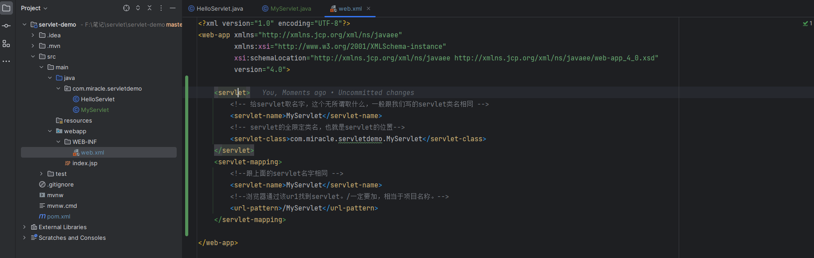
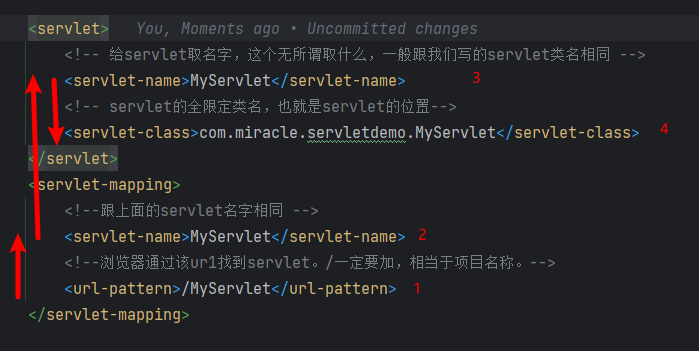
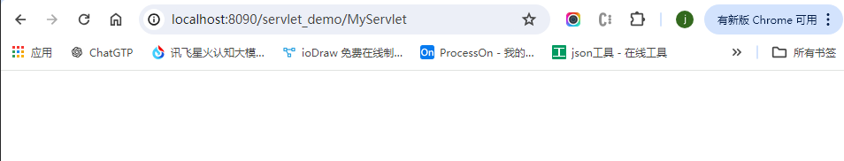
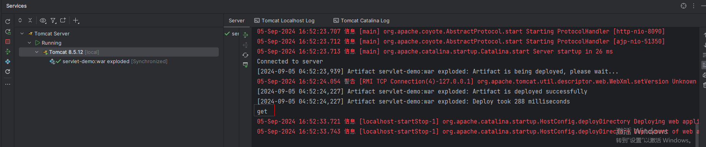

# servlet

学习参考： https://www.cnblogs.com/whgk/p/6399262.html

ideal创建servlet： https://blog.csdn.net/m0_62592554/article/details/132877438


## 一、什么是servlet？

　　　　处理请求和发送响应的过程是由一种叫做Servlet的程序来完成的，并且Servlet是为了解决实现动态页面而衍生的东西。理解这个的前提是了解一些http协议的东西，并且知道B/S模式(浏览器/服务器)。

　　　　B/S:浏览器/服务器。 浏览器通过网址来访问服务器，比如访问百度，在浏览器中输入www.baidu.com，这个时候浏览器就会显示百度的首页，那么这个具体的过程，步骤是怎样的呢？这个就了解一下[http请求和响应](http://www.cnblogs.com/whgk/p/6130882.html)了


## 二、tomcat和servlet的关系

​		Tomcat 是Web应用服务器,是一个Servlet/JSP容器. Tomcat 作为Servlet容器,负责处理客户请求,把请求传送给Servlet,并将Servlet的响应传送回给客户.而Servlet是一种运行在支持Java语言的服务器上的组件. Servlet最常见的用途是扩展Java Web服务器功能,提供非常安全的,可移植的,易于使用的CGI替代品.

​		从http协议中的请求和响应可以得知，浏览器发出的请求是一个请求文本，而浏览器接收到的也应该是一个响应文本。但是在上面这个图中，并不知道是如何转变的，只知道浏览器发送过来的请求也就是request，我们响应回去的就用response。忽略了其中的细节，现在就来探究一下。


​		①：Tomcat将http请求文本接收并解析，然后封装成HttpServletRequest类型的request对象，所有的HTTP头数据读可以通过request对象调用对应的方法查询到。

​		②：Tomcat同时会要响应的信息封装为HttpServletResponse类型的response对象，通过设置response属性就可以控制要输出到浏览器的内容，然后将response交给tomcat，tomcat就会将其变成响应文本的格式发送给浏览器

　

​		Java Servlet API 是Servlet容器(tomcat)和servlet之间的接口，它定义了serlvet的各种方法，还定义了Servlet容器传送给Servlet的对象类，其中最重要的就是ServletRequest和ServletResponse。所以说我们在编写servlet时，需要实现Servlet接口，按照其规范进行操作。


## 三、编写Servlet

​		在前面，我们已经知道了servlet是什么，为什么需要servlet?（为了实现动态网页，而不是显示静态网页，具体情况可以百度查查），tomcat和servlet的关系？等问题。现在来手动编写一个Servlet。

### 3.1、手动编写servlet。

#### 1、创建一个MyServlet继承HttpServlet，重写doGet和doPost方法，也就是看请求的方式是get还是post，然后用不同的处理方式来处理请求，

``` java
public class MyServlet extends HttpServlet {

    @Override
    protected void doGet(HttpServletRequest req, HttpServletResponse resp) throws ServletException, IOException {
        // get请求的处理
        System.out.println("get");
    }

    @Override
    protected void doPost(HttpServletRequest req, HttpServletResponse resp) throws ServletException, IOException {
        // post请求的处理
        System.out.println("post");
    }
}
```

#### 2、在web.xml中配置MyServlet，为什么需要配置？让浏览器发出的请求知道到达哪个servlet，也就是让tomcat将封装好的request找到对应的servlet让其使用。

> web.xml 配置四个东西。



``` xml
    <servlet>
        <!-- 给servlet取名字，这个无所谓取什么，一般跟我们写的servlet类名相同 -->
        <servlet-name>MyServlet</servlet-name>
        <!-- servlet的全限定类名，也就是servlet的位置-->
        <servlet-class>com.miracle.servletdemo.MyServlet</servlet-class>
    </servlet>
    <servlet-mapping>
        <!--跟上面的servlet名字相同 -->
        <servlet-name>MyServlet</servlet-name>
        <!--浏览器通过该ur1找到servlet。/一定要加，相当于项目名称。-->
        <url-pattern>/MyServlet</url-pattern>
    </servlet-mapping>
```

配置之后，浏览器是如何通过我们配置的信息来找到对应的servlet的。



按照步骤，首先浏览器通过http://localhost:8090/servlet_demo/MyServlet来找到web.xml中的url-pattern，这就是第一步，匹配到了url-pattern后，就会找到第二步servlet的名字MyServlet，知道了名字，就可以通过servlet-name找到第三步，到了第三步，也就能够知道servlet的位置了。然后到其中找到对应的处理方式进行处理。

####　3、实验，验证上面配置成功。






### 3.2、详解创建servlet的原理

1. servlet的生命周期是什么？

　　　　　　　　2、为什么创建的servlet是继承自httpServlet，而不是直接实现Servlet接口？

　　　　　　　　3、servlet的生命周期中，可以看出，执行的是service方法，为什么我们就只需要写doGet和doPost方法呢？

　　　　　　　　等这一系列的问题，我们都应该知道，而不应该就单纯的知道如何配置和使用servlet?上面的问题，一一来解答。


